# Easy Translate App for Windows and Android
### made by Pham Tien Thuan, Pham Quoc Viet and Vu Huu Dat for assignment in Python course at PTIT.
- B20DDCCN678 Phạm Tiến Thuận_Leader: Đảm nhiệm phần core, tìm hiểu các thư viện khả thi hay không (ví dụ: thư viện A có hỗ trợ window nhưng lại ko hỗ trợ Android, thư viện A hỗ trợ cả 2 nhưng buildozer không hỗ trợ thư viện A xuất sang APK,...)
    - Tìm hiểu và có demo các logic chức năng của app:
        * Translate text
        * Translate file
        * Translate website
        * Convert and export text từ file.
        * Logic, các thành phần trong api của translate.google.com
        * Text to speech
        * Text copy
    - Tham gia vào các chức năng app:
        * Translate text
        * Translate file
        * Translate website
        * Convert and export text từ file.
        * Text to speech
        * Text copy
        * Clone được giao diện của Google Translate
 
    - Các thư viện đã tìm hiểu và có demo trong ứng dụng:
        * **playsound** - Thư viện phát âm thanh trên window
        * **android.media.MediaPlayer** - Thư viện Java cho phép phát âm thanh
        * **filechooser** - Thư viện mở cửa sổ chọn file trong android và window.
        * **requests** - Dùng để gọi api đến https://translate.google.com/
        * **google-cloud-translate** - Thư viện của google, dùng để dịch tài liệu do không crack được api dịch tài liệu của https://translate.google.com/      
        * **docx**
        * **kivy, kivymd** - thư viện UI multi- platform.
        * **asposecellscloud** - thư viện cho phép convert các xlxs
        * **pynjous** - thư viện cho phép sử dụng các thư viện java trên python.
        * **buildozer** - thư viện cho phép export python sang nhiều platform.
        * **mimetypes** - thư viện cho phép lấy định dạng file.

## Description
- This is a simple app that allows you to translate text from one language to another.
- Easy Translate is available for both Windows and Android.
- This app is still in beta, so there might be some potential bugs.
- Easy Translate is written in Python using Kivy library for interactive user interface.
## Features
- Translate text from one language to another.
- Translate text from text.
- Translate text from image. (coming soon)
- Translate text from voice. (coming soon)
- Translate text from file (txt, docx, pdf, etc). 
- Translate text from url (web page).
- Convert document to html.
- Local history and bookmark
## How to use
- Download the app for your device.
- Open the app.
- Select the language you want to translate from.
- Select the language you want to translate to.
- Type the text you want to translate.
- Click the translate button.
- The translated text will appear.
## Download
- [Windows]( Coming Soon )
- [Android]( Coming Soon )
## Screenshots
### Windows
<table>
    <tr>
        <td><strong>Homescreen</strong></td>
        <td><strong>Select language</strong></td>
    </tr>
    <tr>
        <td>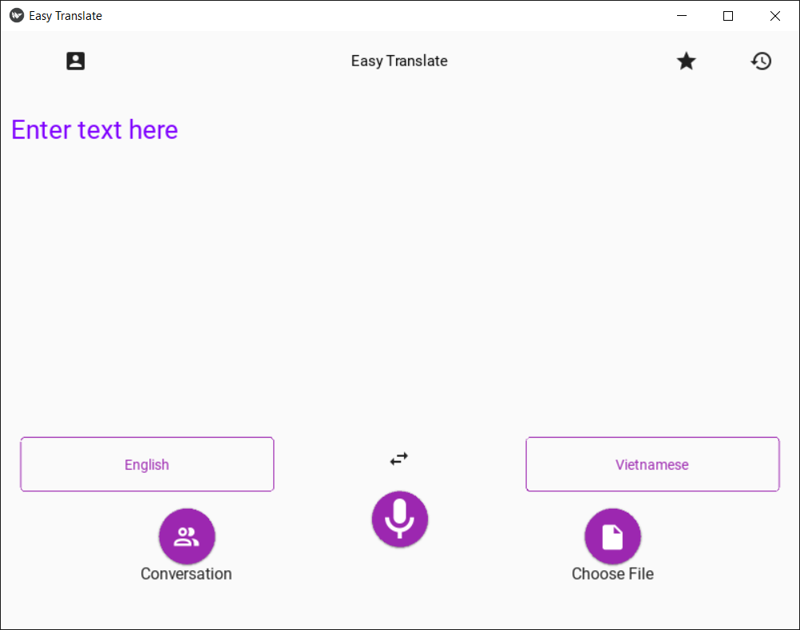</td>
        <td></td>
    <tr>
        <td><strong>File Chooser</strong></td>
    </tr>
    <tr>
        <td>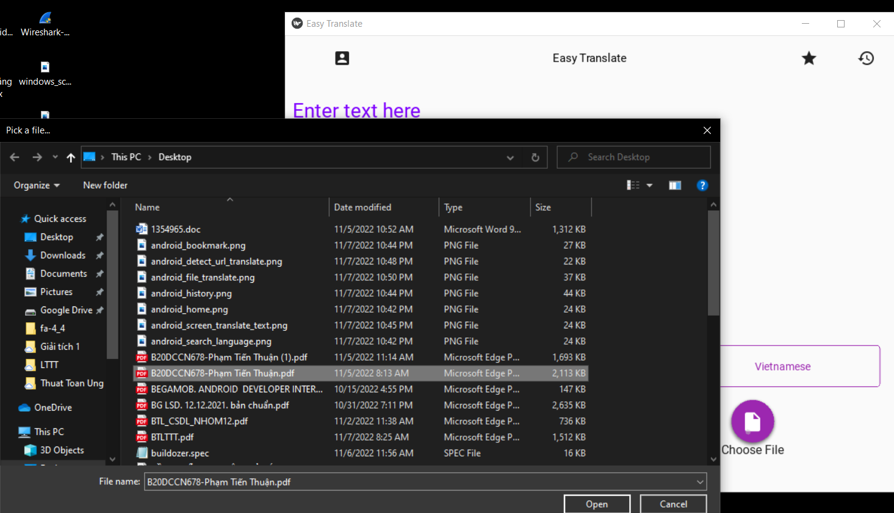</td>
    <tr>
        <td><strong>Bookmark</strong></td>
        <td><strong>History</strong></td>
    </tr>
    <tr>
        <td>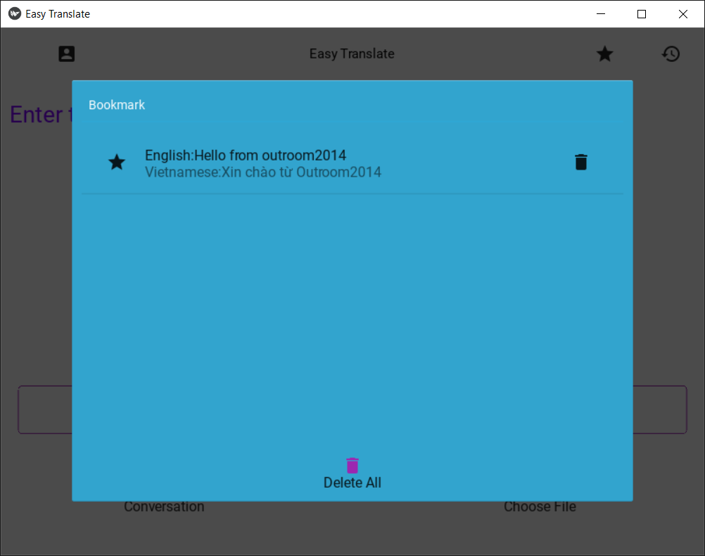</td>
        <td>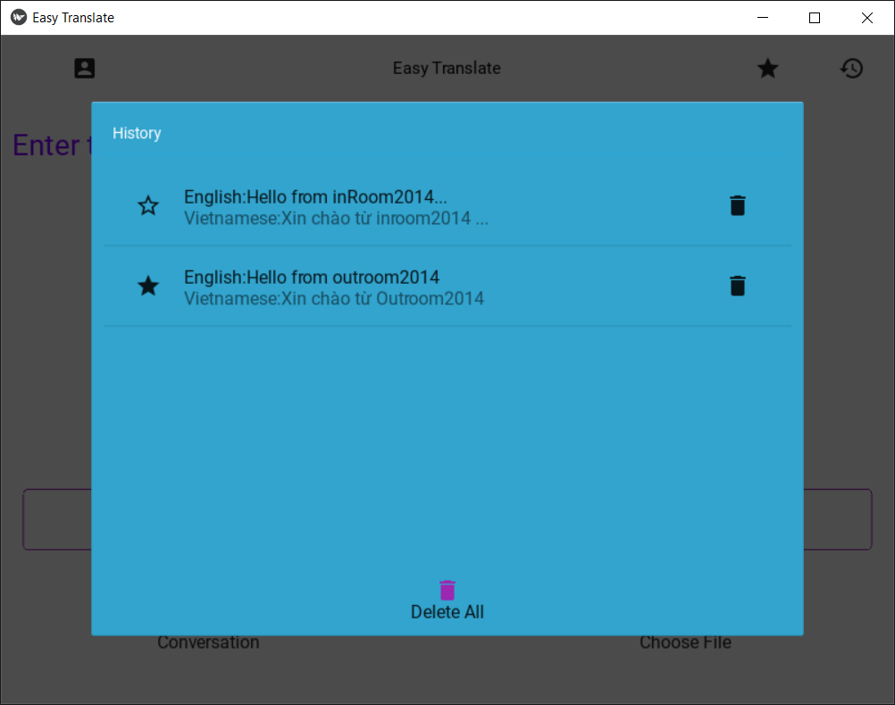</td>
    </tr>
    <tr>
        <td><strong>Screen Translate Text</strong></td>
        <td><strong>Detect Url Translate Web</strong></td>
    </tr>
    <tr>
        <td>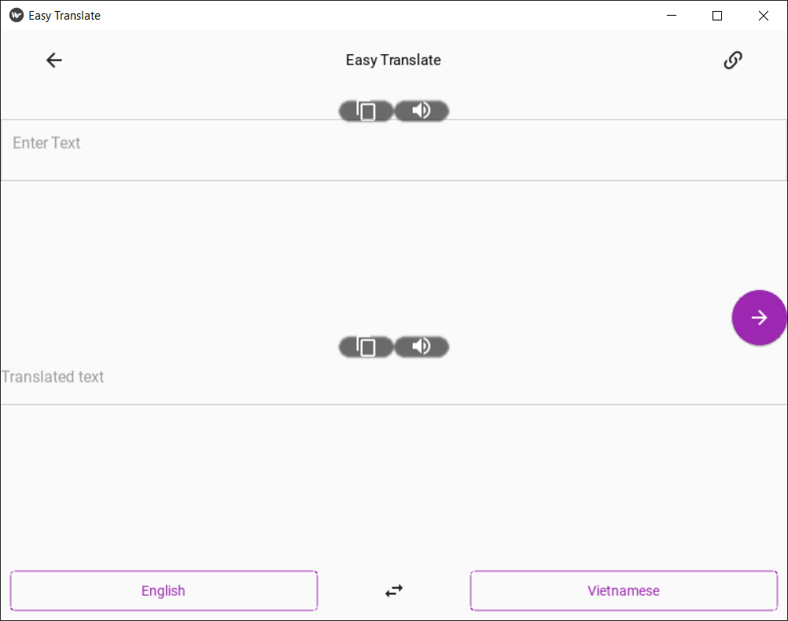</td>
         <td>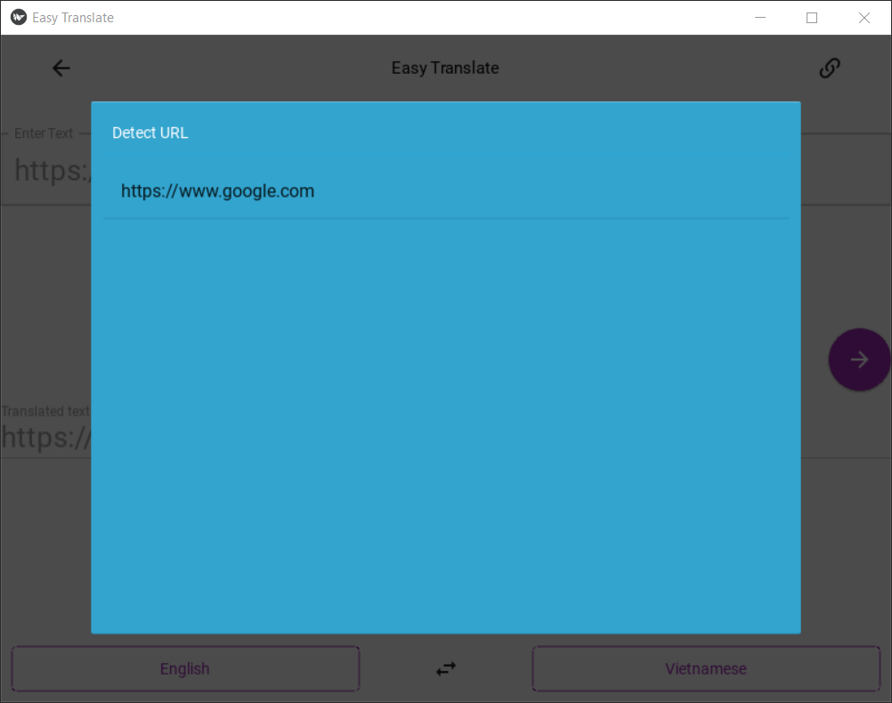</td>
    </tr>
</table>

### Android
<table>
    <tr>
        <td><strong>Homescreen</strong></td>
        <td><strong>Select language</strong></td>
        <td><strong>File Chooser</strong></td>
    </tr>
    <tr>
        <td>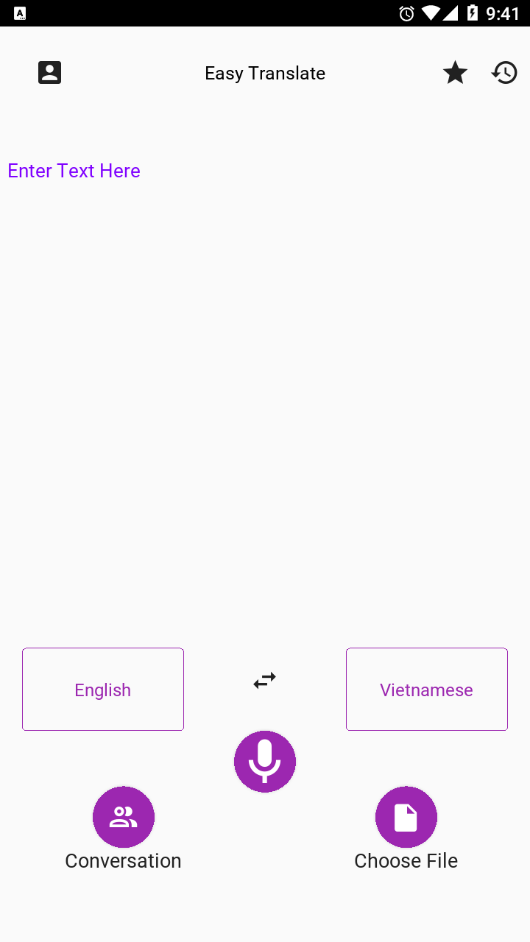</td>
        <td>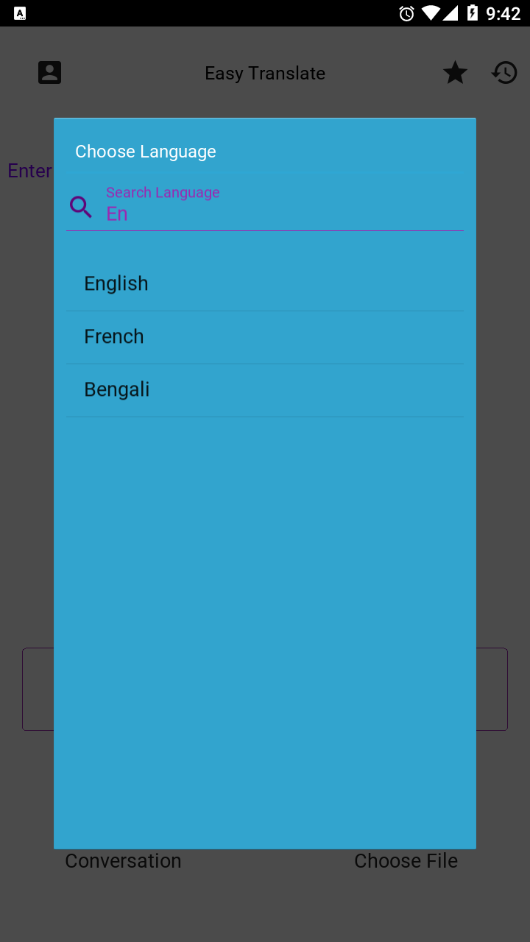</td>
        <td>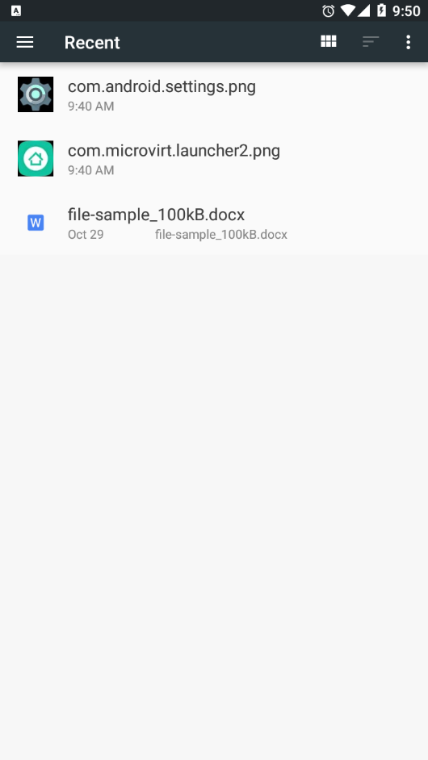</td>
    <tr>
        <td><strong>Bookmark</strong></td>
        <td><strong>History</strong></td>
    </tr>
    <tr>
        <td>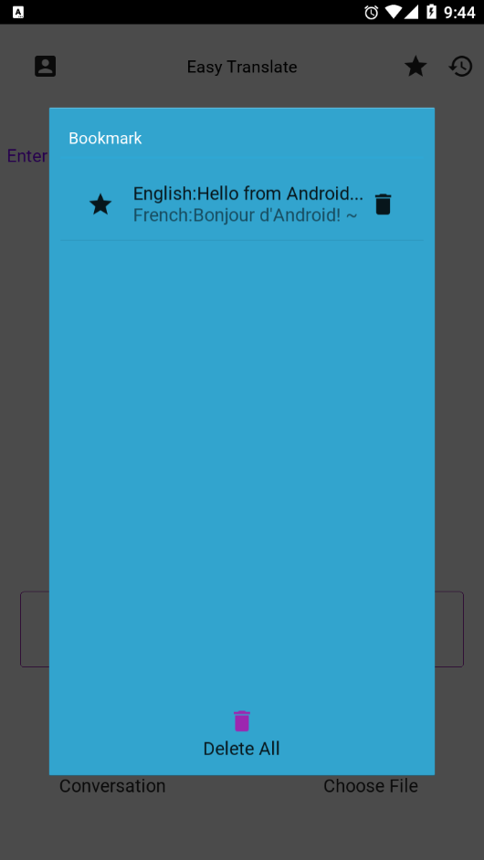</td>
        <td>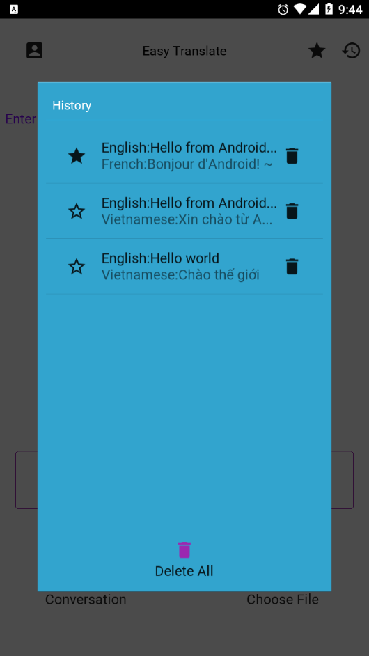</td>
    </tr>
    <tr>
        <td><strong>Screen Translate Text</strong></td>
        <td><strong>Detect Url Translate Web</strong></td>
    </tr>
    <tr>
        <td>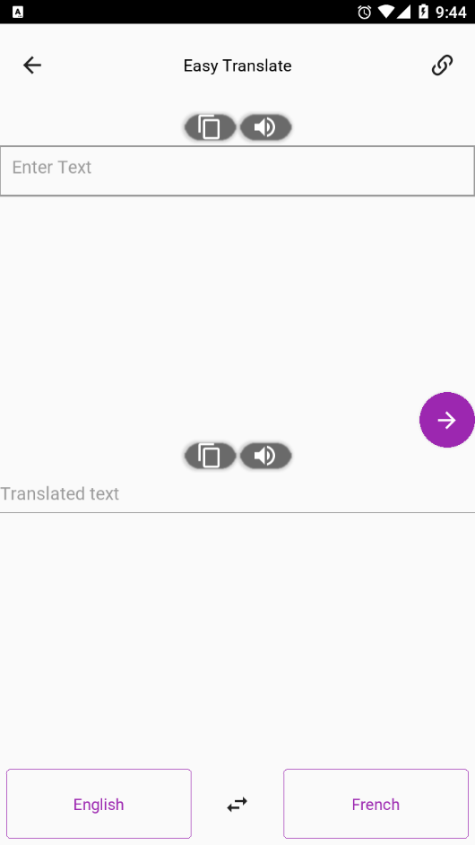</td>
         <td>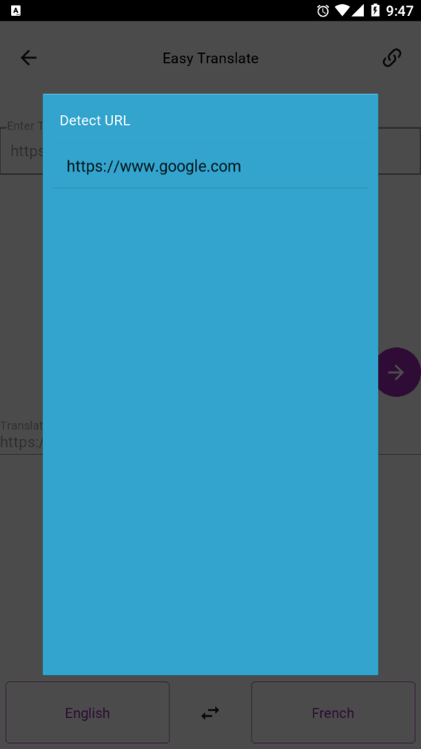</td>
    </tr>
</table>

## Credits
- [Python](https://www.python.org/)
- [Kivy](https://kivy.org/)
- [Google Translate](https://translate.google.com/)
- [Google Translate API](https://pypi.org/project/googletrans/)
