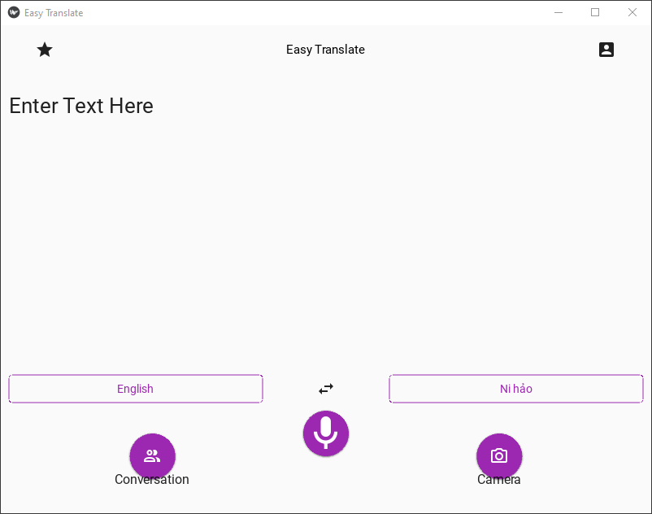
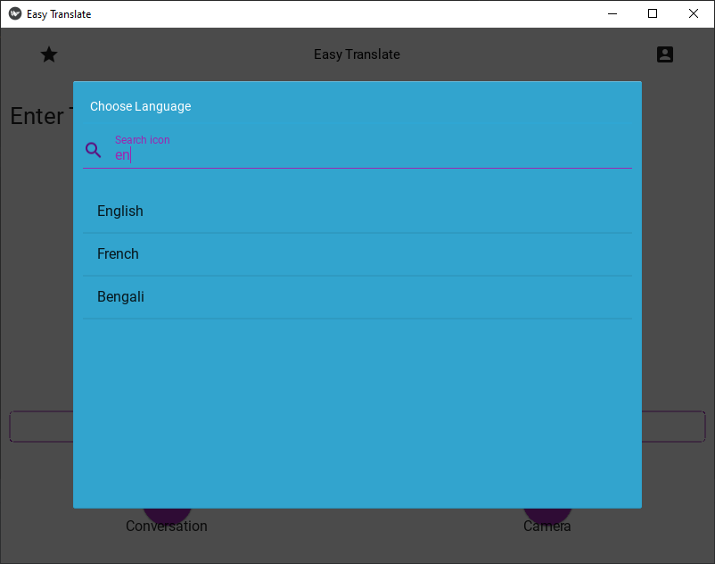

# Easy Translate App for Windows and Android (Beta)
## Description
- This is a simple app that allows you to translate text from one language to another.
- This app is available for Windows and Android.
- This app is still in beta, so there may be some bugs.
- This app is made with Python and Kivy.
## Features
- Translate text from one language to another.
- Translate text from text.
- Translate text from image. (coming soon)
- Translate text from voice. (coming soon)
- Translate text from file (txt, docx, pdf, etc).
- Translate text from url (web page).
## How to use
- Download the app for your device.
- Open the app.
- Select the language you want to translate from.
- Select the language you want to translate to.
- Type the text you want to translate.
- Click the translate button.
- The translated text will appear.
## Download
- [Windows]( Coming Soon )
- [Android]( Coming Soon )
## Screenshots
### Windows
<table>
    <tr>
        <td><strong>Homescreen</strong></td>
        <td><strong>Home select language</strong></td>
    </tr>
    <tr>
        <td></td>
        <td></td>
    </tr>
    <tr>
        <td><strong>Screen Translate Text</strong></td>
    </tr>
    <tr>
        <td></td>
    </tr>
</table>

### Android
- Coming Soon
## Credits
- [Python](https://www.python.org/)
- [Kivy](https://kivy.org/)
- [Google Translate](https://translate.google.com/)
- [Google Translate API](https://pypi.org/project/googletrans/)
